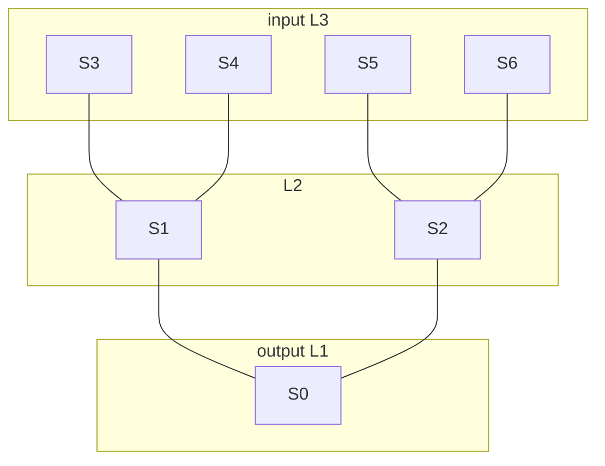
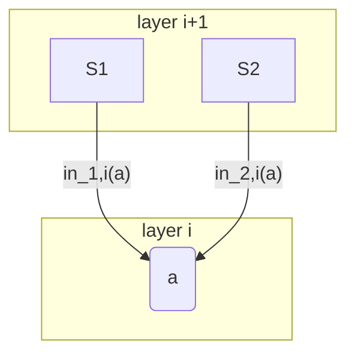
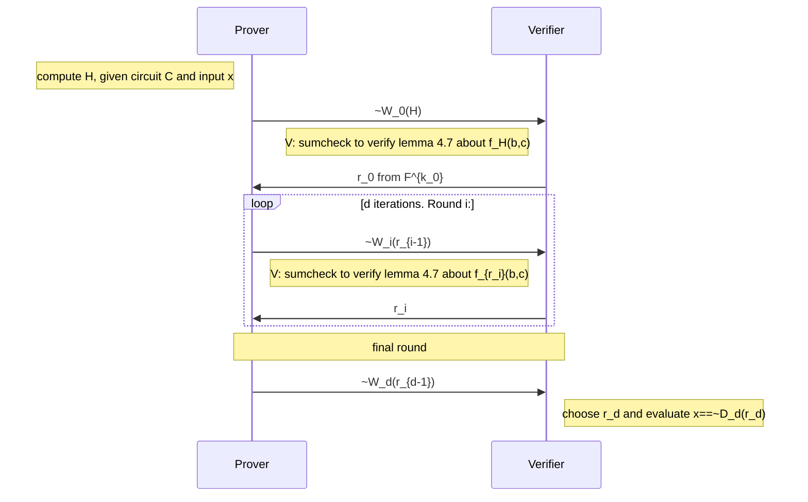

#note #pazk #cryptography 

Interactive proofs, sumcheck, GKR.

## key stuff
- Model of a strong prover and weak verifier
- analyzing sumcheck prover and verifier time
- Some minor applications of sumcheck
- The GKR protocol
- Cost frame: think of the cost of a protocol as on the order of $S$, where S is the number of gates. We want $S=O(p(n))$ with $p$ a small degree polynomial, with $p$ a small degree polynomial, ideally.

## sumcheck
The protocol: Given a $v$ variate polynomial $g$ over $\mathbb F$ , the *weak Verifier* wants a *strong Prover* to compute all evaluations of $g$ over $\mathbb F$:

$$ H:= \sum_{b\in \mathbb F} g(b)$$

Where we're going to interpret b as all possibly binary strings. To constrain the Prover to only a correct output for $H$, it would be nice if the Prover had only to do minimally more work than normal, and the Verifier could run in less than exponential time, and that's what the sumcheck protocol is. 
See book for the protocol description.

But in a nutshell, the Verifier challenges the Prover to compute a Currying of $g$ in each round, reducing it's multivariate-ness by one, by passing a random element in. 
The Prover is then bound to each of its previous answers, and could only arrive at a correct final answer with probability $dv/| \mathbb F|$. More concretely:

### Proof of Soundness of sumcheck (completeness follows naturally)
Suppose the Prover diverges at round $i$, and sends some other polynomial $s_i(X_i)\ne g_i(X_i)$, but $g_i(r_i) = s_i(r_i)$.  By a restriction on the degree $d$ of the polynomial $s_i$, we can exploit the FToAlgebra to obtain the probability of that a collision, $d/| \mathbb F|$ . For the sake of proof convenience, we allow that the prover could have sent the false polynomial in any round, we arrive at a final soundness bound of $dv/| \mathbb F|$.

## Costs
- The verifier sends a random field element in each round
- the Prover responds with the ith polynomial, expressible in $deg_i(g) +1$ elements. 
- The Verifier twice evaluates a polynomial $g_i$ in each round, verifying it against the previous round, and finally takes one evaluation of $g(r_1..r_v)$
- The Prover can curry $g_i$ from $g_{i-1}$ in $deg_i(g)2^{v-i}$ time in each round. $O(\sum_i deg_i(g)2^{v-i}T)=O(2^{v+1}T)$ , assuming $deg_i(g)$ is O(1)

| Communication                   | Rounds | V time              | P time |
| ------------------------------- | ------ | ------------------- | ------ |
| O$(2v+\sum deg_i(g))=^1O(v)$ field elems | $v$    | $O(T+2*\sum deg_i(g))=^1 O(T+v)$ | $O(\sum deg_i(g)2^{v-i}T) =^1 O(T*2^{v})$       |

Where $T$ is the time to evaluate $g$ once, and the equality $=^1$ holds if $deg_i(g)=O(1)$.

This is pretty good: We get a linear time algorithm for V, and a factor of 2 blowup for P, IF WE ASSUME 
- that $deg_i(g)$ is $O(1)$ 
- that the time for the verifier to take a SINGLE evaluation of $g$ ain't too bad. Remember that P took $2^{v+1}$ evaluations of $g$. Our verifier is lazy AF.

## Some Applications
- `#SAT`
- Counting triangles in a graph
- Matrix multiplication verification (skipped)

### `#SAT`
Or in other words, computing the number of satisfying arguments to some boolean formula $\phi$. We need to turn the boolean formula $\phi$ into an arithmetic circuit $\psi$ over $\mathbb F$ that computes the polynomial extension $g$ of $\phi$.  

In simpler english, we have a boolean circuit $\phi$. We want a polynomial expression $g$ to express it, to run our sumcheck on. We can construct $g$ by translating our boolean formula to an arithmetic circuit and Lagrange-interpolating $g$ out of that. We map (all variables in {0,1}):
- $\phi \rightarrow \psi$ 
- AND(a,b) => ab (1 gate)
- OR(a,b) => a+b-ab (3 gates)
- NOT(a) => 1-a (1 gate)

Therefore, if $\phi$ was $S$ gates, $\phi$ is at most $3S$ gates. We can exploit an intuitive upper bound, that $\sum_i deg_i(g)\le 2S$, explained in a footnote, to compute our cost.
For unknown reasons, we switch from $v$ to $n$ notationally, but they are equivalent.

| Communication                            | Rounds | V time                           | P time                                    |
| ---------------------------------------- | ------ | -------------------------------- | ----------------------------------------- |
| O$(2v+\sum deg_i(g))=^1O(v)$ field elems | $v$    | $O(T+2*\sum deg_i(g))=^1 O(T+v)$ | $O(\sum deg_i(g)2^{v-i}T) =^1 O(T*2^{v})$ |
| $O(2v+2S)$                               | $v$    | $O(T+4S)$                        | $O(T*2^v *2S)$                            |
| $O(v+S)$                                 | $v$    | $O(n+S)$                         | $O(2^v *S^2)$                            |

Noting that $g(r)$ is evaluatable gate-by-gate in time $T=O(n+S)$. Finally, the soundness error is $dv/| \mathbb F|= 2Sv/| \mathbb F|$ .

The remark about IP and PSPACE is a bit abstract, but I interpret it as relying on the statement:
> PSPACE is equivalent to `#SAT`

which the majority of the remark attempts to justify. If we take that for granted, we've shown $IP\supseteq \#SAT$ => IP=PSPACE.

### Counting triangles in Graphs
Gives a brute force algorithm to count triangles in graphs, and a verifying algorithm to check it.  Taking our graph as an adjacency matrix (see book), where we define $f_A(x,y)$ = "is there an edge between vertices (x,y)". Then a natural BF to count triangles would be:

$$\Delta = \frac 1 6 \sum_{x,y,z} f_A(x,y)*f_A(y,z)*f_A(x,z)$$

where $x,y,z\in \{0,1\}^{\log n}$, so we have our function to sumcheck in $\Delta$. 

#### Analysis
Let n be the dimension of the Adjacency graph. The degree of each $g_i$ will be 3. A single evaluation of $g$ will run in $O(n^2)$ time, which will dominate the Verifier's time as we compute next.
| Communication                            | Rounds      | V time                           | P time                                    |
| ---------------------------------------- | ----------- | -------------------------------- | ----------------------------------------- |
| O$(2v+\sum deg_i(g))=^1O(v)$ field elems | $v=3\log n$ | $O(T+2*\sum deg_i(g))=^1 O(T+v)$ | $O(\sum deg_i(g)2^{v-i}T) =^1 O(T*2^{v})$ |
| O$(6\log n+3v) = O(\log n)$               | $3\log n$         | $O(n^2+2*9\log n)=O(n^2+\log n)=O(n^2)$ | $O(\sum deg_i(g)2^{v-i}T) = O(2^{3 \log n}*n^2)=O(n^5)$ |

Our soundness bound will be $dv/| \mathbb F|=9\log n / | \mathbb F|$. 

## Harry Potter and the GKR Protocol, the novel
jk, canonical physics still applies, the only magic here is a bit of information theory. 

What do we have so far: **The sumcheck protocol, an IP that can be applied to $\#SAT$ **

What we want: **An interactive proof for a problem in NP with V running in polynomial time in the number of arguments**

What's the issue: **Real world entities don't want to solve large instances of PSPACE-complete or $\#P$ complete problems in the worst case.**

Can we get: **An IP for problems in P, NC, or L, with a verifier running in Linear Time?** Recall that our verifier before ran in $O(T+\sum deg_i(g)) =^1 O(T+v)$, which was only sometimes linear, if evaluating $g$ was linear and the degree of $g$ was constant, in the number of variables (though the latter statement is vacuously true if we only bind variables to {0,1}, but that's before our MLE). Also, our Prover would love to run in time $O(poly(S))$ (recall that out $\#SAT$ prover ran in exponential time.)

The **key feature** of GKR is that we get a **doubly efficient IP** (recall doubly efficient => if naive time, space to solve is O(T), O(s), Prover runs in O(T), O(s), Verifier runs in linear time).  Until GKR in 2008, the (not doubly-efficient) superpolynomial time $\#SAT$ IP given in S4.2 was the best we had.

### So, what's this magic protocol you're hyping
Information Theory is still the only magic. We're going to set up an arithmatic circuit, like in $\#SAT$. V, P need to agree on:
- $\mathcal C$ - a **log-space-uniform** circuit of fan in 2 over some finite field $\mathbb F$  
	- what does log-space mean in this context - well, if there's 8 variables, a fan-in 2 circuit would require 4 first order gates, 2 second order gates, and 1 final gate, so that's not logarithmic in the number of variables, that's $O(n)$. 
		- Oh there's an answer. It's a circuit $\mathcal C$ that possesses a **succinct implicit description** (oof) in the sense that there's a log-space algorithm taking as input:
			- The label of gate $a$ of $\mathcal C$ and is cabable of determining all relevant info about that gate. So that could possibly be a log-space algorithm, but it would need to have info about n-1 gates of an n-argument circuit. Revisit later.
		- what constitutes "relevant info?"
			- labels of all of $a$'s neigbors
			- $a$ is mul or addition gate
	- how does $\mathcal C$ relate to our $\#SAT$ circuit?

If $S$ is the number of gates of $C$ and $n$ is the number of variables, the **key feature** is that the 
- prover should run in time $poly(S)$, or even linear in $S$, as is the case in some application papers (eg, section 4.4,4.5). 
- verifier also conveniently runs in $O(d\log S)$ , where d=depth of circuit (logarithmic in n).
- If $S=2^{o(n)}$, we have ourselves a pretty darn efficient alg, allowing a sub-linear verifier time, and naive prover time. Windgardium Leviosa can't even come close to that magic.

table comparison time, because tables were the real magic all along
|                         | Communication                             | Rounds                     | V time                           | P time                                    |     |
| ----------------------- | ----------------------------------------- | -------------------------- | -------------------------------- | ----------------------------------------- | --- |
| GKR                     | $d\cdot$ polylog($S$) field elements      | $d\cdot$ polylog($S$)      | $O(n+d\cdot$polylog$(S))$        | $O(d\cdot \log(S)/\| \mathbb F\|)$        |     |
| GKR w/ $d=\log(n)$      | $\log n\cdot$ polylog($S$) field elements | $\log n\cdot$ polylog($S$) | $O(n+\log n\cdot$polylog$(S))$   | $O(\log n\cdot \log(S)/\| \mathbb F\|)$   |     |
| $\#SAT$                 | O$(2v+\sum deg_i(g))=^1O(v)$ field elems  | $v$                        | $O(T+2*\sum deg_i(g))=^1 O(T+v)$ | $O(\sum deg_i(g)2^{v-i}T) =^1 O(T*2^{v})$ |     |
| $\#SAT$ const deg assmp | $O(2v+2S)$                                | $v$                        | $O(T+4S)$                        | $O(T*2^v *2S)$                            |     |
| $\#SAT$ T=O(n)=O(S) assmp                 | $O(v+S)$                                  | $v$                        | $O(S)$                         | $O(2^v *S^2)$                             |     |

Note that all this communication complexity will eventually get reduced to a single round, with a blowing up of field size, with the Fiat Shamir transformation.
But also magic, the verifier doesn't even look at all of $\mathcal C$. How? that's what we're about to do. 

### Overview of protocol
Input:
- $\mathcal C$ : circuit of fan-in 2, depth $d$ over $\mathbb F$ computing any function we care about. Call layer $d$ the input layer, layer 1 the output layer. 

*example circuit: $\mathcal C: d=3$*

The protocol proceeds after P claims some value H as output of the circuit with input $x$. Each iteration reduces the prover's $2^i$ gates to $2^{i-1}$ gates, by **applying the sumcheck protocol.**
Given $\mathcal C$ of size $S$, depth $d$, fan-in two: 
- number layers 0 to d 
- $S_i=2^{k_i}$ - a power of 2, denoting the number of gates at layer $i$
- let the output of gate $j$ in layer $i$ be described by the function: $W_i: \{0,1\}^{k_i} \rightarrow \mathbb F$
- The GKR protocol will denote a **wiring predicate**, encoding pairs of wires from layer $i+1$ and $i$.
	- Let $in_{1,i},in_{2,i}: \{0,1\}^{k_i} \rightarrow\{0,1\}^{k_{i+1}}$ describe the left and right wires of gate $a$ at layer $i$. Eg in the following, $in_{1,i}(a)=S1;in_{2,i}(a) = S2$
- let add$_i$, mult$_i: \{0,1\}^{k_i+2k_{i+1}} \rightarrow \{0,1\}$, the wiring predicate of layer $i$ taking as input three gate labels $(a,b,c)$.
	- add$_i$(a,b,c) = 1 if a is an addition gate, AND b=S1,c=S2 are as above.
	- add$_i$(a,b,c) = 0 otherwise; likewise for mult$_i$.
	- as usual, we can construct their multilinear extensions, denoted $\widetilde{add_i}, \widetilde{mult_i}$ 
	- $D_i:\{0,1\}^{k_i}\rightarrow \mathbb F$, the function mapping the label of a gate to the claimed value of its output

### Protocol in detail
Initially, the prover and verifier agree on some circuit $\mathcal C$ and some input set. 
Round 0: 
- The prover computes $H= \mathcal C(x)$ sends the evaluation $W_0(H)$ the claimed output. 
- The verifier responds with a random value $r_0\in \mathbb F^{k_0}$. This random value serves to randomly select a gate for the Verifier to inspect in row 0.
Round i: 
- Prover: 
	- send $W_i(r_{i-1})$, the claimed evaluation of the output of gate $r_{i-1}$ in layer $i$
- Verifier: 
	- respond with $r_i\in \mathbb F^{k_i}$
Final Round:
- Prover:
	- send $W_d(r_{d-1})$, the claimed evaluation of the output of gate $r_{d-1}$ in layer $d$, the input layer
- Verifier: 
	- select $r_d$, evaluate $\tilde D_d(r_d) == \tilde W_d(r_d)$ 

We'll exploit a Lemma on the expression for $\tilde W_i(r_i)$ in terms of $\tilde W_{i+1}$:

$$ \tilde W_i(z) = \sum_{b,c} \widetilde{add}_i(z,b,c)\cdot (\tilde W_{i+1}(b)+\tilde W_{i+1}(c))+\widetilde{mult}_i(z,b,c)\cdot (\tilde W_{i+1}(b)\cdot\tilde W_{i+1}(c))$$ 
which I read as a sort of Lagrange interpolation for wire values. For proof, see book. 

In the ith round, $\mathcal V$, $\mathcal P$ run sumcheck verifying that: 

$$ f_{r_i}^{(i)}(b,c) = \widetilde{add}_i(z,b,c)\cdot (\tilde W_{i+1}(b)+\tilde W_{i+1}(c))+\widetilde{mult}_i(z,b,c)\cdot (\tilde W_{i+1}(b)\cdot\tilde W_{i+1}(c))$$ 

#### How does $\mathcal V$ evaluate $f_{r_i}^{(i)}(b^*,c^*)$?
Requires evaluating $\widetilde{add}_i(r_i, b^*,c^*)$, same mult.  $\mathcal V$ asks $\mathcal P$ to provide $z_1= \tilde W_{i+1}(b^*), z_2 = \tilde W_{i+1}(c^*)$. On iteration $i+1$, the verifier can verify the values are as claimed. 

## Questions/Notes for group
- what does log-space mean in this context - well, if there's 8 variables, a fan-in 2 circuit would require 4 first order gates, 2 second order gates, and 1 final gate, so that's not logarithmic in the number of variables, that's $O(n)$. 
	- Oh there's an answer. It's a circuit $\mathcal C$ that possesses a **succinct implicit description** (oof) in the sense that there's a log-space algorithm taking as input:
		- The label of gate $a$ of $\mathcal C$ and is capable of determining all relevant info about that gate. So that could possibly be a log-space algorithm, but it would need to have info about n-1 gates of an n-argument circuit. Revisit later.
- how does $\mathcal C$ relate to our $\#SAT$ circuit? 
	- sortof similar, but not applying sumcheck directly to the $\#SAT$ problem, using a different protocol.
- Did the Prover and the verifier agree on the input to the circuit before running protocol?

## Typos
- On page 59 we label layers 0 to d, on earlier pages we label from 1 to d (the hard problem in computer science)
